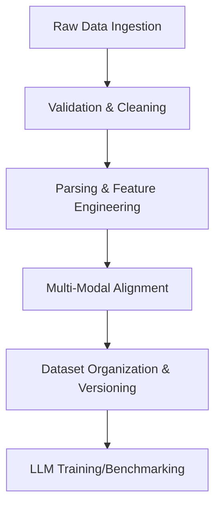

## Actionable Checklist (Step-by-Step Tutorial)

### 1. Prunt3D Ingestion Script
- [ ] Create `prunt3d_ingest.py` and define required/optional files
- [ ] Implement file presence and integrity checks
- [ ] Add schema validation and consistency checks
- [ ] Log successes, errors, and skipped runs
- [ ] Test on sample Prunt3D data
- [ ] Document script usage

### 2. Verbose G-code Parser
- [ ] Create `gcode_verbose_parser.py` and implement comment/metadata extraction
- [ ] Output structured data (JSON/CSV)
- [ ] Add unit tests for edge cases
- [ ] Document parser usage

### 3. Feature Extraction Module
- [ ] Create `feature_extraction.py` for sensor and print metrics
- [ ] Integrate with parsed G-code and metadata
- [ ] Output feature vectors
- [ ] Add tests and document features

### 4. Multi-Modal Alignment Tool
- [ ] Create `align_modalities.py` to synchronize all data streams
- [ ] Validate with sample data
- [ ] Document alignment process

### 5. Dataset Versioning & Organization
- [ ] Define directory structure and integrate DVC
- [ ] Write script to generate metadata files
- [ ] Document organization/versioning workflow

### 6. Pipeline Automation & Testing
- [ ] Develop ETL scripts/workflows for all steps
- [ ] Write integration tests
- [ ] Set up logging and error reporting
- [ ] Document the full pipeline in a tutorial-style guide

## Actionable Checklist
- [ ] Complete Prunt3D ingestion script
- [ ] Implement verbose G-code parser
- [ ] Develop feature extraction module
- [ ] Build multi-modal alignment tool
- [ ] Automate dataset versioning
- [ ] Write pipeline tests
- [ ] Document pipeline usage

# Data Engineering & Management Plan

## Purpose
Comprehensive plan for data collection, storage, preprocessing, augmentation, and privacy for the LLM-controlled 3D printer OS. This document is intended for data engineers, ML researchers, and contributors working on the data pipeline. It provides rationale for technology choices, onboarding guidance, and practical examples.

---

## Quick Navigation & Related Documents
- [Master Actionable Checklist](master_actionable_checklist.md)
- [LLM Training & Fine-Tuning Strategy](llm_training_strategy.md)
- [Evaluation & Benchmarking Plan](evaluation_benchmarks_plan.md)
- [Prunt3D Ingestion Design](prunt3d_ingest_design.md)

---

## Rationale for Key Technology Choices
- **DVC (Data Version Control):** Enables reproducible, versioned datasets and seamless collaboration across local/cloud storage. Chosen for its integration with Git and support for large files.
- **Hierarchical Directory Structure:** Organizes data by phase, modality, and scenario, making it easy to locate, audit, and extend datasets.
- **JSON/CSV Formats:** Widely supported, human-readable, and easy to parse for both structured and semi-structured data.
- **Automated ETL Scripts:** Ensures consistency, reduces manual errors, and supports scaling as data volume grows.

---

## Example Directory Structure
```text
sim_data/
  phase1_simulation/
    run_00001/
      print.gcode
      sensors.csv
      images/
        layer_001.png
        ...
      audio/
        print_audio.wav
      metadata.json
    run_00002/
      ...
  phase2_realworld/
    ...
```

---

## Sample Data Formats
**sensors.csv**
```csv
timestamp,temperature,position_x,position_y,position_z,vibration
0.00,210.1,0.0,0.0,0.0,0.01
0.05,210.2,0.1,0.0,0.0,0.02
...existing data...
```

**metadata.json**
```json
{
  "run_id": "run_00001",
  "printer_model": "Prusa MK3S",
  "material": "PLA",
  "start_time": "2025-07-01T12:00:00Z",
  "scenario": "nozzle_clog_test"
}
```

---

## Data Pipeline Workflow (Textual Diagram)


---

## 1. Data Sources & Ingestion
- **Simulation Data:** Prunt3D outputs (G-code, sensor logs, images, audio)
- **Sliced G-code (Verbose Mode):** G-code files generated with verbose comments and metadata from slicers (e.g., Cura, PrusaSlicer)
- **Real-World Data:** Printer logs, sensor streams, user feedback, maintenance records
- **Multi-Modal Data:** Text, images, audio, time-series sensor data

---

## 2. Data Storage & Organization
- Hierarchical directory structure by phase, modality, and scenario type
- Use of metadata files for provenance and traceability
- Scalable storage solutions (local, cloud, hybrid)
- Data versioning with DVC or similar tools

---

## 3. Preprocessing & Feature Engineering
- Cleaning: remove corrupt/incomplete records, normalize formats
- Tokenization: G-code (including verbose comments/metadata), configuration files, logs
- Parsing and extracting structured information from verbose G-code (layer changes, print settings, slicer metadata)
- Feature extraction: sensor trends, error patterns, print quality metrics
- Multi-modal alignment: synchronize data streams to common timeline

---

## 4. Data Augmentation & Synthesis
- Parameter sweeps and scenario generation in simulation
- Noise injection and domain randomization
- Synthetic failure mode creation
- Multi-material and complex geometry scenarios

---

## 5. Privacy, Compliance & Security
- Anonymization of user and printer identifiers
- Local processing for sensitive data
- Consent management and audit trails
- Compliance with relevant data protection standards (GDPR, etc.)

---

## 6. Pipeline Automation & Monitoring
- Automated ETL scripts for ingestion, cleaning, and transformation
- Continuous integration with simulation and real-world data sources
- Monitoring for data drift, quality, and pipeline failures
- Alerting and logging for anomalies

---

## 7. Phased Implementation Plan

### Phase 1: Simulation Data Pipeline
- Build ingestion and preprocessing pipeline for Prunt3D data
- Validate data quality and feature extraction
- Organize and version simulation datasets

### Phase 2: Real-World Data Integration
- Expand pipeline to handle real printer logs and sensor data
- Implement privacy and compliance features
- Align real and simulated data for downstream use

### Phase 3: Multi-Modal & Advanced Scenarios
- Integrate image, audio, and complex sensor data
- Automate augmentation and synthetic scenario generation
- Monitor and maintain data quality at scale

### Milestones & Dependencies
- Data pipeline automation and validation
- Privacy/compliance implementation
- Feedback loop for continuous improvement

---
